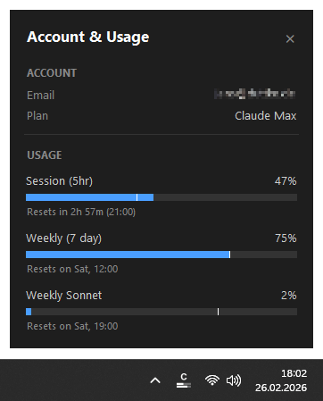

# Usage Monitor for Claude

**See your Claude.ai rate limits at a glance - right from your Windows system tray.**

Usage Monitor for Claude is a lightweight Windows desktop tool that shows your current Claude.ai usage as a live icon in the notification area. Always know how much of your session and weekly rate limits you have left - without opening a browser.



## Features

- **Portable** - single EXE, no installation required. Just download, place anywhere, and run
- **Autostart** - optional "Start with Windows" toggle in the right-click menu
- **Live tray icon** - displays a "C" during normal use, switches to the current percentage when session usage exceeds 50%, and shows "✕" when you hit the rate limit
- **Two progress bars** in the icon: top bar = 5-hour session limit, bottom bar = 7-day weekly limit
- **Hover tooltip** with a quick summary of your 5-hour and 7-day usage, including reset times
- **Detail popup** (left-click) - dark-themed window showing your account info (email, plan) and separate usage bars for Session, Weekly, Weekly Sonnet, and Weekly Opus limits
- **Time marker** - a white vertical line on each bar shows how much time has passed in the current period, so you can tell whether usage is ahead of or behind the clock
- **Color warning** - bars turn red once usage reaches 80%
- **Reset notification** - get a Windows notification when your session (>95%) or weekly (>98%) quota resets after being nearly exhausted
- **Reset countdown** below each bar, e.g. "Resets in 2h 20m (14:30)"
- **Smart refresh** - updates every 2 minutes by default; automatically speeds up to 1-minute intervals while you are actively using Claude, then slows back down
- **Manual refresh** via right-click menu at any time
- **Multilingual UI** (English, German, French, Spanish, Portuguese, Italian, Japanese, Korean, Hindi, Indonesian) - automatically selected based on your Windows display language
- **Zero configuration** - authenticates through your existing Claude Code login

---

## Requirements

- **Windows 10 or Windows 11** (64-bit)
- **[Claude Code](https://docs.anthropic.com/en/docs/claude-code)** installed and logged in (CLI, VS Code extension, or JetBrains plugin - any variant works). The app reads the OAuth token that Claude Code stores locally (`~/.claude/.credentials.json`). No API key, no manual token entry.

> [!TIP]
> If the token is missing or expired, the app shows a notification and a "!" icon. Simply log in to Claude Code again and the monitor picks it up automatically.

---

## Quick Start

**No Python required.** Download the latest [**UsageMonitorForClaude.exe**](https://github.com/jens-duttke/usage-monitor-for-claude/releases/latest), place it wherever you like, and run it. To remove, disable "Start with Windows" in the context menu first (if enabled), then delete the file.

---

## How to Use

| Action | What happens |
|---|---|
| **Hover** over the tray icon | Tooltip shows 5h and 7d usage percentages with reset times |
| **Left-click** the tray icon | Opens the detail popup with account info and all usage bars |
| **Right-click** the tray icon | Context menu: open popup, refresh now, autostart toggle, or quit |
| **Escape** or click outside | Closes the detail popup |

### Tray icon not visible?

Windows may hide new tray icons by default. To keep the icon always visible:

1. Right-click the **taskbar** → **Taskbar settings**
2. Expand **Other system tray icons** (Win 11) or **Select which icons appear on the taskbar** (Win 10)
3. Toggle **UsageMonitorForClaude** to **On**

### Reading the progress bars

Each bar in the detail popup has up to three visual elements:

1. **Blue fill** - how much of the limit you have used (turns **red** at 80%+)
2. **White vertical line** - how much *time* has passed in the current period. If the blue fill is to the left of this line, you are using Claude slower than the rate limit refills. If it is to the right, you are on track to hit the limit before the period resets.
3. **Reset text** - when the limit resets, shown as a countdown with clock time

---

## Building from Source

<details>
<summary>For developers who want to build the EXE themselves</summary>

### Prerequisites

- Python 3.10+
- pip

### Setup

```bash
git clone https://github.com/jens-duttke/usage-monitor-for-claude.git
cd usage-monitor-for-claude
python -m venv .venv
.venv\Scripts\activate
pip install -r requirements.txt
```

### Run

```bash
python usage_monitor_for_claude.py
```

### Build EXE

```bash
python build.py
```

Produces `dist/UsageMonitorForClaude.exe` (~20 MB), a single-file executable that bundles Python and all dependencies.

### Create a Release

1. Update the version in [`version_info.py`](version_info.py) (`filevers`, `prodvers`, `FileVersion`, `ProductVersion`)
2. In [`CHANGELOG.md`](CHANGELOG.md), rename `## [Unreleased]` to `## [1.x.x] - YYYY-MM-DD` and add a fresh empty `## [Unreleased]` section above it
3. Build the EXE with `python build.py`
4. Commit, tag, push, and publish:

   ```bash
   git add -A && git commit -m "Release v1.x.x"
   git tag v1.x.x
   git push origin main v1.x.x
   gh release create v1.x.x dist/UsageMonitorForClaude.exe --title "v1.x.x" --notes "Release notes here"
   ```

</details>

---

## License

MIT

---

## Disclaimer

This is an independent, community-built project. It is **not** created, endorsed, or officially supported by [Anthropic](https://www.anthropic.com/). "Claude" and "Anthropic" are trademarks of Anthropic, PBC. Use of these names is solely for descriptive purposes to indicate compatibility.
