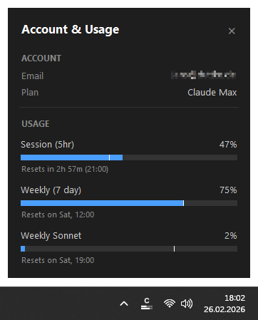

🇬🇧 [English](README.md) | 🇺🇦 [Українською](README.uk.md)

# Usage Monitor for Claude

**Відстежуйте ліміти використання Claude у реальному часі - прямо з системного трея Windows.**

Нативний додаток для Windows, який показує ваше використання Claude з першого погляду - легкий, портативний та повністю відкритий для аудиту. Ліміти використання спільні для claude.ai, Claude Code та розширень для IDE (VS Code та JetBrains) - завжди знайте, скільки часу сесії та тижневого ліміту у вас залишилося.



## Функції

- **Портативний** - один EXE файл (~20 МБ), без встановлення, без Electron, без сторонніх середовищ виконання. Завантажте, розмістіть де завгодно, запустіть
- **Нульова конфігурація** - автентифікація через ваш існуючий логін Claude Code. Без ключів API, без ручного введення токенів
- **Жива іконка в треї** з двома прогрес-барами (сесія + тиждень), відображення відсотків при високому використанні, та кольори, що підлаштовуються під світлу або темну теми панелі завдань
- **Детальна статистика** (лівий клік) показує інформацію про акаунт, прогрес-бари для всіх типів квот (Сесія, Тиждень, Sonnet, Opus, додаткове використання), зворотний відлік до скидання, встановлені версії Claude Code та свіжість даних
- **Маркер часу** на кожній смужці - біла лінія, що показує час, який минув у поточному періоді. Ви одразу бачите, чи випереджаєте ви ліміт, чи використовуєте Claude повільніше за плин часу
- **Розумні сповіщення** - настроювані пороги для кожного типу квоти, з режимом врахування часу, який сповіщає лише тоді, коли використання випереджає графік. Сповіщення про скидання, коли майже вичерпана квота поповнюється
- **Автоматичне оновлення токена** - коли сесія OAuth закінчується, у фоновому режимі запускається `claude update` для оновлення токена без втручання користувача. Якщо встановлено CLI-оновлення, показується сповіщення
- **Версії Claude Code** - вікно статистики показує встановлені версії Claude Code (CLI, VS Code, Cursor, Windsurf), щоб ви завжди знали, яку версію використовує кожне середовище
- **Адаптивне опитування** - прискорюється під час активного використання, зупиняється, коли комп'ютер не використовується або заблокований, підлаштовується під найближчі скидання квот та робить паузу при помилках лімітів
- **Багатомовна підтримка**: доступно 13 мовами (англійська, німецька, іспанська, французька, хінді, індонезійська, італійська, японська, корейська, португальська, українська та китайська)
- **Настроювання** - можливість змінити інтервали опитування, кольори, пороги сповіщень та інше через [JSON-файл налаштувань](#configuration)

---

## Безпека та прозорість

Цей інструмент працює з вашим OAuth-токеном Claude Code, тому ви повинні мати змогу переконатися в його безпеці. Код структурований для легкого аудиту:

- **Єдиний мережевий напрямок** - спілкується виключно з `api.anthropic.com`, жодних інших хостів
- **Облікові дані залишаються локально** - OAuth-токен використовується лише в HTTP-заголовках Authorization, ніколи не логується, не зберігається в інших місцях і не передається третім сторонам
- **Тільки для читання** - додаток ніколи не записує файли на диск
- **Жодного динамічного виконання коду** - без `eval()`, `exec()`, `compile()` або динамічних імпортів
- **Без обфускації** - немає закодованих рядків, прихованих URL або зашифрованої логіки
- **Модульна архітектура** - невеликі, фокусовані модулі. Критично важливий код (облікові дані, виклики API) ізольовано в одному файлі ([`api.py`](usage_monitor_for_claude/api.py))
- **Мінімальні залежності** - лише три відомі пакети: [requests](https://pypi.org/project/requests/), [Pillow](https://pypi.org/project/pillow/), [pystray](https://pypi.org/project/pystray/)

---

## Вимоги

- **Windows 10 або Windows 11** (64-біт)
- **[Claude Code](https://docs.anthropic.com/en/docs/claude-code)** встановлений та авторизований (CLI, розширення VS Code або плагін JetBrains - підійде будь-який варіант). Додаток зчитує OAuth-токен, який Claude Code зберігає локально (`~/.claude/.credentials.json`).

> [!TIP]
> Якщо термін дії токена закінчується, додаток автоматично запускає `claude update` для його оновлення. Якщо токен відсутній взагалі, додаток покаже сповіщення та іконку "!" - просто увійдіть у Claude Code, і монітор підхопить його автоматично.

---

## Швидкий старт

**Python не потрібен.** Завантажте останню версію [**UsageMonitorForClaude.exe**](https://github.com/jens-duttke/usage-monitor-for-claude/releases/latest), розмістіть його де завгодно та запустить. Щоб видалити, спочатку вимкніть "Start with Windows" у контекстному меню (якщо ввімкнено), а потім видаліть файл.

---

## Як користуватися

| Дія | Що відбувається |
|---|---|
| **Навести** на іконку в треї | Підказка показує відсотки використання за 5 год та 7 днів з часом скидання |
| **Лівий клік** на іконку | Відкриває вікно статистики з інфо про акаунт та всіма смужками використання |
| **Правий клік** на іконку | Контекстне меню: відкрити статистику, автозавантаження або вихід |
| **Escape** або клік зовні | Закриває вікно статистики |

### Іконка в треї не відображається?

Windows може приховувати нові іконки за замовчуванням. Щоб іконка була завжди видимою:

1. Правий клік на **панелі завдань** -> **Налаштування панелі завдань**
2. Розгорніть **Інші іконки системного трея** (Win 11) або **Виберіть іконки, що відображаються на панелі завдань** (Win 10)
3. Увімкніть перемикач для **UsageMonitorForClaude**

### Як читати прогрес-бари

Кожна смужка у вікні статистики має до трьох візуальних елементів:

1. **Синє заповнення** - скільки ліміту ви вже використали (стає **червоним** при 80%+)
2. **Біла вертикальна лінія** - скільки *часу* минуло в поточному періоді. Якщо синє заповнення ліворуч від цієї лінії, ви використовуєте Claude повільніше, ніж оновлюється квота. Якщо праворуч - ви ризикуєте вичерпати ліміт до завершення періоду.
3. **Текст скидання** - коли ліміт буде оновлено (зворотний відлік з часом на годиннику)

---

## Налаштування

Усі параметри працюють "з коробки" - конфігураційний файл не обов'язковий. Щоб змінити поведінку, створіть файл з назвою `usage-monitor-settings.json` лише з тими ключами, які ви хочете змінити:

```json
{
  "poll_interval": 180,
  "bar_fg": "#00cc66",
  "bar_fg_high": "#ff6600"
}
```

Додаток шукає цей файл у двох місцях (перший знайдений має пріоритет):

1. **Поруч із EXE файлом** (або в корені проєкту при запуску з коду)
2. **`~/.claude/usage-monitor-settings.json`**

Додаток ніколи не створює і не змінює цей файл сам. Для початку створіть порожній файл і додайте потрібні ключі.

<details>
<summary>Доступні налаштування</summary>

### Пороги сповіщень

Налаштуйте відсотки використання, які активують сповіщення Windows. Сесійні та тижневі квоти мають окремі пороги. Встановіть порожній масив `[]`, щоб вимкнути сповіщення для певного типу квоти.

| Ключ | За замовчуванням | Опис |
|-----|---------|-------------|
| `alert_thresholds_five_hour` | `[50, 80, 95]` | Пороги для Сесії (5 год) |
| `alert_thresholds_seven_day` | `[95]` | Пороги для всіх тижневих квот (7 днів, Sonnet, Opus) |
| `alert_time_aware` | `true` | Сповіщати лише коли використання випереджає графік |
| `alert_time_aware_below` | `90` | Перевірка графіку застосовується лише для порогів нижче цього значення; пороги вище або рівні спрацьовують завжди |

### Інтервали опитування

| Ключ | За замовчуванням | Опис |
|-----|---------|-------------|
| `poll_interval` | `180` | Секунди між оновленнями через API |
| `poll_fast` | `120` | Секунди, коли використання активно зростає |
| `poll_fast_extra` | `2` | Екстра-швидке опитування після того, як використання припинило зростати |
| `poll_error` | `30` | Секунди після тимчасової помилки (5xx, мережа). Для помилок ліміту (429) використовується експоненціальна затримка |
| `max_backoff` | `900` | Максимальна затримка в секундах для помилок ліміту (15 хв) |
| `idle_pause` | `300` | Секунди бездіяльності до паузи опитування (0 = вимкнути). Опитування також зупиняється, коли робоча станція заблокована |

### Мова

| Ключ | За замовчуванням | Опис |
|-----|---------|-------------|
| `language` | *(автовизначення)* | Зміна мови інтерфейсу. Доступні: `de`, `en`, `es`, `fr`, `hi`, `id`, `it`, `ja`, `ko`, `pt-BR`, `uk`, `zh-CN`, `zh-TW` |

### Валюта

API Anthropic не містить інформації про валюту, тому додаток визначає символ валюти за налаштуваннями вашої Windows. Якщо валюта вашої Windows відрізняється від тієї, в якій Anthropic виставляє рахунки, ви можете перевизначити символ тут. Форматування чисел (роздільник, позиція символу) завжди відповідає системним налаштуванням.

| Ключ | За замовчуванням | Опис |
|-----|---------|-------------|
| `currency_symbol` | *(автовизначення)* | Перевизначення символу валюти (наприклад, `"$"`, `"€"`, `"₴"`) |

### Кольори іконки в треї

Перевизначення окремих каналів як масиви RGBA `[R, G, B, A]` (0–255). Не вказані ключі залишаються стандартними.

| Ключ | За замовчуванням | Опис |
|-----|---------|-------------|
| `icon_light` | `{"fg": [255,255,255,255], "fg_half": [255,255,255,80], "fg_dim": [255,255,255,140]}` | Світлі іконки для темної панелі завдань |
| `icon_dark` | `{"fg": [0,0,0,255], "fg_half": [0,0,0,80], "fg_dim": [0,0,0,140]}` | Темні іконки для світлої панелі завдань |

### Кольори вікна статистики

| Ключ | За замовчуванням | Опис |
|-----|---------|-------------|
| `bg` | `"#1e1e1e"` | Фон |
| `fg` | `"#cccccc"` | Текст |
| `fg_dim` | `"#888888"` | Приглушений текст (підписи, час скидання) |
| `fg_heading` | `"#ffffff"` | Заголовки розділів |
| `bar_bg` | `"#333333"` | Фон прогрес-барів |
| `bar_fg` | `"#4a9eff"` | Колір заповнення |
| `bar_fg_high` | `"#e05050"` | Колір заповнення при використанні ≥ 80% |

</details>

---

## Збірка з коду

<details>
<summary>Для розробників, які хочуть зібрати EXE самостійно</summary>

### Попередні вимоги

- Python 3.10+
- pip

### Налаштування

```bash
git clone https://github.com/jens-duttke/usage-monitor-for-claude.git
cd usage-monitor-for-claude
python -m venv .venv
.venv\Scripts\activate
pip install -r requirements.txt
```

### Запуск

```bash
python -m usage_monitor_for_claude
```

### Збірка EXE

```bash
python build.py
```

Створює `dist/UsageMonitorForClaude.exe` (~20 МБ) - єдиний файл, що містить Python та всі залежності.

### Створення релізу

1. Оновіть залежності: `pip install --upgrade -r requirements.txt`
2. Оновіть `__version__` у [`usage_monitor_for_claude/__init__.py`](usage_monitor_for_claude/__init__.py) та версію у [`version_info.py`](version_info.py) (`filevers`, `prodvers`, `FileVersion`, `ProductVersion`)
3. У [`CHANGELOG.md`](CHANGELOG.md) перейменуйте `## [Unreleased]` на `## [1.x.x] - YYYY-MM-DD` та додайте свіжий порожній розділ `## [Unreleased]` зверху
4. Запустіть тести: `python -m unittest discover -s tests`
5. Тестування: `python -m usage_monitor_for_claude` - перевірте іконку, вікно статистики та налаштування
6. Зберіть EXE командою `python build.py`
7. Тестування EXE: `dist/UsageMonitorForClaude.exe` - перевірте працездатність
8. Коміт, тег, пуш та публікація:

   ```bash
   git add -A && git commit -m "Release v1.x.x"
   git tag v1.x.x
   git push origin main v1.x.x
   gh release create v1.x.x dist/UsageMonitorForClaude.exe --title "v1.x.x" --notes "<список змін з CHANGELOG.md>"
   ```

</details>

---

## Ліцензія

MIT

---

## Дисклеймер

Це незалежний проєкт, створений спільнотою. Він **не** створений, не схвалений і не підтримується офіційно компанією [Anthropic](https://www.anthropic.com/). "Claude" та "Anthropic" є торговими марками Anthropic, PBC. Використання цих назв є виключно описовим для вказівки на сумісність.
